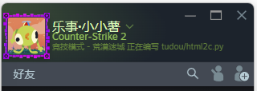

# 🎮 Steam Code Status for VS Code

<div align="center">
    
    <br>
    <br>
    <a href="https://github.com/tudou0133/VSCode_SteamCodeStatus">
        
    </a>
    <a href="https://github.com/tudou0133/VSCode_SteamCodeStatus/blob/main/LICENSE">
        
    </a>
    <a href="https://marketplace.visualstudio.com/vscode">
        
    </a>
</div>

<br>

**Steam Code Status** 是一个可以将你的 Visual Studio Code 编程活动实时同步到 Steam 好友列表（Rich Presence）的插件。赛博云监工，让你的好友知道你正在敲代码，而不是在摸鱼！

<div align="center">
    
    <br>
    <i>☝️ 实时同步你的编程状态到 Steam 好友列表 (支持组队显示)</i>
</div>

<br>
---
本插件想法和早期实现来源自 罗吉@furrylogy 薯在此郑重致谢!!!

## 🔧 工作原理 (How it Works)

本插件采用了 **前后端分离** 的架构来实现跨进程通信，以解决 VS Code (Node.js) 无法直接稳定调用 Steam C++ 接口的问题：

1.  **VS Code 插件端 (Frontend)**：使用 TypeScript 编写，负责监听编辑器状态（文件名、行数、项目名），并将数据格式化为纯文本。
2.  **C# 桥接器 (Backend)**：一个轻量级的 .NET 控制台程序 (`SteamRichPresenceBridge.exe`)，它作为子进程在后台运行。
3.  **通信机制**：插件通过 **StdIO (标准输入输出管道)** 将状态数据实时发送给 C# 进程。
4.  **Steam SDK**：C# 进程调用底层 `Steamworks.NET` 库，与本地运行的 Steam 客户端通信，最终将状态更新到好友列表。

---

## ✨ 主要特性 (Features)

* **⚡ 实时同步**：自动显示当前编辑的文件名、所属项目、代码行数和语言。
* **🎨 高度自定义**：支持强大的**模板语法**，你可以随心所欲定义状态显示的格式。
* **🧠 智能格式化**：支持**条件隐藏**。如果项目名为空，插件会自动隐藏多余的分隔符。
* **👥 组队/房间模拟**：支持设置 Steam 组队信息，在好友列表显示“队伍规模：2/4”。
* **🔒 手动锁定模式**：一键锁定状态为 "Fixing bugs"，无视文件切换。

---

## 🚀 进阶指南：自定义 AppID 与数据抓取

默认情况下，插件使用 `AppID: 480` (Spacewar)，这是 Valve 专门提供给开发者的测试游戏。如果你想显示为其他游戏（例如 *Wallpaper Engine* 或你自己的游戏），请按以下步骤操作：

### 1. 修改 AppID
在 VS Code 设置中搜索 `codeStatus.steamAppId`，填入目标游戏的 ID（例如 Wallpaper Engine 是 `431960`）。

> **注意**：你必须在 Steam 库中拥有该游戏，或者该游戏是免费/测试应用，否则初始化会失败。

### 2. 获取 Rich Presence Key (关键步骤)
**这步最重要！** 不同的游戏使用不同的 Key 来显示状态，你不能直接把文件名塞给一个不支持的 Key。

**如何找到正确的 Key？**
1.  确保你的 Steam 客户端已登录。
2.  启动你想模仿的那个游戏。
3.  打开浏览器访问 Valve 官方测试页面：[https://steamcommunity.com/dev/testrichpresence](https://steamcommunity.com/dev/testrichpresence)
4.  登录后，你通过该页面看到你当前游戏的所有 **Rich Presence 数据**。
5.  观察页面上的 JSON 数据，找到类似 `status`, `steam_display`, `description` 这样的字段名。

### 3. 配置插件
假设你在网页上看到该游戏用 `description` 字段来显示文字：
* **VS Code 设置** -> `codeStatus.dynamicKey` -> 填入 `description`。
* 如果游戏需要特定的静态参数（如 `gamemode=survival`），请在 `codeStatus.staticArgs` 中配置。

---

## ⚙️ 配置说明 (Configuration)

| 设置项 | 默认值 | 说明 |
| :--- | :--- | :--- |
| `codeStatus.statusTemplate` | `[{projectName} | ]{fileName}` | 状态显示的文字模板。 |
| `codeStatus.steamAppId` | `480` | 伪装的游戏 ID。 |
| `codeStatus.dynamicKey` | `status` | 用于传输文件名的动态 Key (Spacewar 专用)。 |
| `codeStatus.groupId` | (空) | 设置房间/组队 ID。 |
| `codeStatus.groupSize` | (空) | 设置队伍人数 (如 `4`)。 |

---

## 🛠️ 源码编译 (Build from Source)

如果你克隆了本仓库，需要分别编译后端和插件前端：

1.  **安装依赖**
    ```bash
    npm install
    ```

2.  **编译 C# Bridge** (必须安装 .NET SDK)
    ```bash
    cd backend
    dotnet publish -c Release -r win-x64 -o win-x64
    cd ..
    ```

3.  **编译插件**
    ```bash
    npm run compile
    ```

---

## 👏 致谢 (Credits)

本项目的部分核心功能基于以下优秀的开源项目：

* **想法和早期实现** - *Ideas and early implementation* - [Github](https://github.com/furrylogy)
* **[Steamworks.NET](https://github.com/rlabrecque/Steamworks.NET)**: C# wrapper for Valve's Steamworks API. (MIT License)

---

## 📄 License

[MIT](LICENSE) © 2026 tudou0133