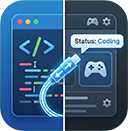

# 🎮 Steam Code Status for VS Code

<div align="center">
    
    <br>
    <br>
    <a href="https://github.com/tudou0133/VSCode_SteamCodeStatus/blob/main/LICENSE">
        
    </a>
    <a href="https://marketplace.visualstudio.com/vscode">
        
    </a>
</div>

<br>

**Steam Code Status** 是一个可以将你的 Visual Studio Code 编程活动实时同步到 Steam 好友列表（Rich Presence）的插件。赛博云监工，让你的游戏好友知道你正在敲代码，而不是在摸鱼！

---
本插件想法和早期实现来源自 罗吉@furrylogy 薯在此郑重致谢!!!

## ✨ 主要特性 (Features)

* **⚡ 实时同步**：自动显示当前编辑的文件名、所属项目、代码行数和语言。
* **🎨 高度自定义**：支持强大的**模板语法**，你可以随心所欲定义状态显示的格式。
* **🧠 智能格式化**：支持**条件隐藏**（Conditional Rendering）。如果项目名为空，插件会自动隐藏多余的分隔符，保持状态栏整洁。
* **🔒 手动锁定模式**：正在修紧急 Bug？一键锁定状态为 "Fixing critical bugs"，无视文件切换。
* **👥 组队/房间模拟**：支持设置 Steam 组队信息（Party/Group），在好友列表显示“队伍规模：2/4”，模拟与朋友一起开发的场景。
* **💤 自动空闲检测**：当你没有打开任何文件或 VS Code失去焦点时，自动切换为 "Away" 状态。

---

## ⚙️ 配置说明 (Extension Settings)

你可以在 VS Code 设置中搜索 `codeStatus` 来修改以下配置：

| 设置项 (ID) | 类型 | 默认值 | 说明 |
| :--- | :--- | :--- | :--- |
| `codeStatus.enabled` | boolean | `true` | 是否启用插件。 |
| `codeStatus.statusTemplate` | string | `[{projectName} | ]{fileName}` | **核心配置**：定义状态栏显示的格式（详见下文模板语法）。 |
| `codeStatus.idleText` | string | `Away` | 当没有打开文件或窗口失去焦点时显示的文字。 |
| `codeStatus.groupId` | string | (空) | **组队 ID**。设置一个房间名（如 `MyTeam`），用于启用 Steam 组队显示。 |
| `codeStatus.groupSize` | string | (空) | **队伍人数**。例如填 `4`，配合 groupId 使用。 |
| `codeStatus.steamAppId` | string | `480` | 使用的 Steam App ID（默认为 Spacewar 或自定义工具 ID）。 |

---

## 📝 模板语法 (Template Syntax)

这是本插件最强大的功能。你可以在 `codeStatus.statusTemplate` 中使用变量和条件组。

### 1. 可用变量
| 变量名 | 描述 | 示例 |
| :--- | :--- | :--- |
| `{fileName}` | 当前文件名 | `index.ts` |
| `{projectName}` | VS Code 工作区名称 | `MySuperProject` |
| `{folderName}` | 文件所在的上一级目录名 | `src` (对于 `src/index.ts`) |
| `{fileExt}` | 文件后缀 | `ts` |
| `{language}` | 语言模式 | `TypeScript` |
| `{lineCount}` | 当前文件行数 | `128` |
| `{filePath}` | 相对路径 | `frontend/src/index.ts` |

### 2. 条件组 `[...]`
使用中括号 `[]` 包裹的内容为**条件组**。
* **规则**：如果中括号内的**任意一个变量**为空（或未定义），则**整个中括号内的内容（包括文字和符号）都会被隐藏**。
* **用途**：完美解决 "没有项目名时多出一个竖线" 的尴尬问题。

#### 示例 A：标准格式
* **模板**: `[{projectName} | ]{fileName}`
* **场景 1 (有项目)**: 显示 `MyProject | app.js`
* **场景 2 (无项目)**: 显示 `app.js` (注意前面的 ` | ` 自动消失了)

#### 示例 B：极客模式
* **模板**: `Editing {fileName} [in {projectName}] [{lineCount} lines]`
* **显示**: `Editing server.go in Backend 200 lines`

---

## 🎮 使用指南 (Usage)

### 1. 启用组队显示 (Party Mode)
想在 Steam 好友列表显示你和小伙伴正在“组队”写代码？
1.  在设置中找到 `codeStatus.groupId`，填入一个你们约定的暗号，例如 `DreamTeam`。
2.  在 `codeStatus.groupSize` 中填入人数，例如 `2`。
3.  确保你的小伙伴也填了**完全一样**的 `groupId`。
4.  Steam 会自动将你们识别为同一队伍！

### 2. 手动状态锁定 (Manual Override)
有时候你想显示特定的骚话，或者不想暴露文件名：
1.  按 `Ctrl+Shift+P` (或 Cmd+Shift+P) 打开命令面板。
2.  输入并执行 `CodeStatus: Set Manual Status`。
3.  输入你想显示的文字（例如 "Debugging..."）。
4.  **解锁**：再次运行该命令，不输入任何内容直接回车即可恢复自动模式。

---

## 🛠️ 源码编译与开发 (Build from Source)

如果你是从 GitHub 下载的源码，由于本插件包含 C# 后端程序，你需要手动编译才能运行。

### 前置要求
* [Node.js](https://nodejs.org/) & npm
* [.NET SDK](https://dotnet.microsoft.com/download) (建议 .NET 6.0 或更高版本)

### 编译步骤

1.  **安装依赖**
    ```bash
    npm install
    ```

2.  **编译 C# 后端 (Bridge)**
    这是最关键的一步。你需要编译 `SteamRichPresenceBridge.exe` 并放入指定目录。
    ```bash
    cd backend
    # 编译并发布到插件目录
    dotnet publish -c Release -r win-x64 -o win-x64
    cd ..
    ```
    *确保 `backend/win-x64/` 目录下生成了 `.exe` 文件。*

3.  **编译 TypeScript 插件**
    ```bash
    npm run compile
    ```

4.  **调试运行**
    在 VS Code 中按 `F5` 启动调试窗口。

---

## ⚠️ 常见问题

**Q: 为什么 Steam 不显示状态？**
A:
1. 请确保 Steam 客户端已运行且已登录。
2. 检查插件是否已激活（随便打开一个文件）。
3. 如果你是手动编译的，请检查 `backend/win-x64/SteamRichPresenceBridge.exe` 是否存在。

**Q: "组队"没有显示？**
A: `groupId` 和 `groupSize` 必须同时设置。另外，Steam 的组队显示依赖于具体的 AppID 策略，默认的 480 (Spacewar) 通常支持，但部分网络环境下可能不稳定。

---

## 📄 License

[MIT](LICENSE) © 2026 tudou0133