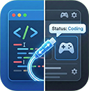
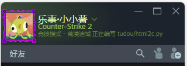

# 🎮 Steam Code Status for VS Code

<div align="center">
    
    <br>
    <br>
    <a href="https://github.com/tudou0133/VSCode_SteamCodeStatus">
        
    </a>
    <a href="https://github.com/tudou0133/VSCode_SteamCodeStatus/blob/main/LICENSE">
        
    </a>
    <a href="https://marketplace.visualstudio.com/vscode">
        
    </a>
</div>

<br>

**Steam Code Status** 是一个可以将你的 Visual Studio Code 编程活动实时同步到 Steam 好友列表（Rich Presence）的插件。化身赛博云监工，让你的好友知道你正在肝代码，而不是在摸鱼！

<div align="center">
    
    <br>
    <i>☝️ 实时同步你的编程状态到 Steam 好友列表 (支持组队显示)</i>
</div>

---

## ✨ 主要特性 (Features)

* **⚡ 实时同步**：自动显示当前编辑的文件名、所属项目、代码行数和语言。
* **🎨 高度自定义**：支持强大的**模板语法**，你可以随心所欲定义状态显示的格式。
* **🧠 智能格式化**：支持**条件隐藏**。如果项目名为空，插件会自动隐藏多余的分隔符。
* **👥 组队/房间模拟**：支持设置 Steam 组队信息，在好友列表显示“队伍规模：2/4”。
* **🔒 手动锁定模式**：一键锁定状态为 "Fixing bugs"，无视文件切换。

---

## 📖 简易上手指导 (Getting Started)

只需简单的三步，即可让你的 VS Code 状态在 Steam 上亮起！

### 第一步：保持 Steam 客户端运行
在启动插件之前，请确保你的电脑上已经打开并登录了 **Steam 客户端**。

### 第二步：在 VS Code 中搜索插件
打开 Visual Studio Code，点击左侧边栏的 **扩展 (Extensions)** 图标（或按下 `Ctrl+Shift+X` / `Cmd+Shift+X`）。

### 第三步：安装并启动
在搜索框中输入 `Steam Code Status`，找到本插件并点击 **安装 (Install)**。
安装完成后，只需在 VS Code 中随便打开一个代码文件，你的 Steam 状态就会自动变成 *“正在玩 Spacewar - [项目名] 正在编辑 xxx.ts”* 啦！

---

## 🚀 进阶指导：自定义游戏与状态配置

默认情况下，插件使用 `AppID: 480` (Spacewar，Valve 的开发者测试游戏)。如果你想把状态伪装成其他游戏（例如 **CS2** 或 **Wallpaper Engine**），你需要进行自定义配置。

### 1. 如何打开插件设置？
1. 在 VS Code 中点击左下角的 ⚙️ **齿轮图标**，选择 **设置 (Settings)**。
2. 在搜索框中输入 `codeStatus`。
3. 你将看到所有相关的配置项：

| 设置项 | 默认值 | 说明 |
| :--- | :--- | :--- |
| `codeStatus.steamAppId` | `730` | 伪装的目标游戏 ID (必须是你库中拥有的游戏)。 |
| `codeStatus.statusTemplate` | `[{projectName} | ]{fileName}` | 状态显示的文字排版模板。 |
| `codeStatus.dynamicKey` | `status` | 用于接收代码状态动态文本的 Key。 |
| `codeStatus.staticArgs` | (空) | 游戏特定的静态参数 (如地图、模式等)。 |
| `codeStatus.groupId` | (空) | 设置房间/组队 ID。 |
| `codeStatus.groupSize` | (空) | 设置队伍人数 (如 `4`)。 |

---

### 2. 核心教学：如何抓取其他游戏的参数？（以 CS2 为例）

**注意：** 不同的游戏使用不同的 `Key` 来显示状态文字，如果你随便乱填，状态是无法显示出来的。我们需要借用 Valve 的官方工具来抓取这些参数。

假设我们想在写代码时，让 Steam 显示我们在玩 **CS2 (Counter-Strike 2)**：

#### 步骤 A：获取游戏的富文本 JSON
1. 确保你的 Steam 已登录，并在电脑上**实际运行一次 CS2**。
2. 保持游戏开启，打开浏览器访问 Valve 官方测试页面：[https://steamcommunity.com/dev/testrichpresence](https://steamcommunity.com/dev/testrichpresence)
3. 在页面中，找到 CS2 对应的区域，你会看到一段类似下方的 JSON 数据。仔细观察 `steam_display` 或 `status` 相关的字段名。

#### 步骤 B：提取有效参数并填入 VS Code 设置
根据抓取到的 CS2 参数，我们需要在 VS Code 的 `codeStatus` 设置中做如下替换：

* **AppID** (`-app`): CS2 的游戏 ID 是 `730`。
  👉 将 `codeStatus.steamAppId` 修改为 `730`
* **显示模板** (`-template`): CS2 控制状态显示的模板是 `#display_GameKnownMapScore`。
  👉 将 `codeStatus.statusTemplate` 修改为 `#display_GameKnownMapScore`
* **动态文本接收口** (`-key`): CS2 使用 `game:score` 这个键值来接收动态变化的文字。我们将把写代码的状态塞进这里！
  👉 将 `codeStatus.dynamicKey` 修改为 `game:score`
* **静态环境参数** (`-static`): CS2 还需要补充当前的模式和地图才能正常显示，例如竞技模式和荒漠迷城。
  👉 在 `codeStatus.staticArgs` 中配置: `{"game:mode": "competitive", "game:map": "de_mirage"}` *(注：请根据实际插件支持的格式填写，如 JSON 或逗号分隔)*。

配置完成后，重启 VS Code，你的好友就会看到你在 CS2 的竞技模式里“疯狂敲代码”了！

---

## 🔧 工作原理 (How it Works)

本插件采用了 **前后端分离** 的架构来实现跨进程通信，以解决 VS Code (Node.js) 无法直接稳定调用 Steam C++ 接口的问题：

1.  **VS Code 插件端 (Frontend)**：使用 TypeScript 编写，负责监听编辑器状态，并将数据格式化为纯文本。
2.  **C# 桥接器 (Backend)**：一个轻量级的 .NET 控制台程序 (`SteamRichPresenceBridge.exe`)，它作为子进程在后台运行。
3.  **通信机制**：插件通过 **StdIO (标准输入输出管道)** 将状态数据实时发送给 C# 进程。
4.  **Steam SDK**：C# 进程调用底层 `Steamworks.NET` 库，与本地运行的 Steam 客户端通信，最终将状态更新到好友列表。

---

## 🛠️ 源码编译 (Build from Source)

如果你克隆了本仓库想进行二次开发，需要分别编译后端和前端：

1.  **安装依赖**
    ```bash
    npm install
    ```

2.  **编译 C# Bridge** (需安装 .NET SDK)
    ```bash
    cd backend
    dotnet publish -c Release -r win-x64 -o win-x64
    cd ..
    ```

3.  **编译插件**
    ```bash
    npm run compile
    ```

---

## 👏 致谢 (Credits)

本项目的部分核心功能基于以下优秀的开源项目，在此郑重致谢：

* **想法和早期实现** - *Ideas and early implementation* - 罗吉@furrylogy [Github](https://github.com/furrylogy)
* **[Steamworks.NET](https://github.com/rlabrecque/Steamworks.NET)**: C# wrapper for Valve's Steamworks API. (MIT License)

---

## 📄 License

[MIT](LICENSE) © 2026 tudou0133